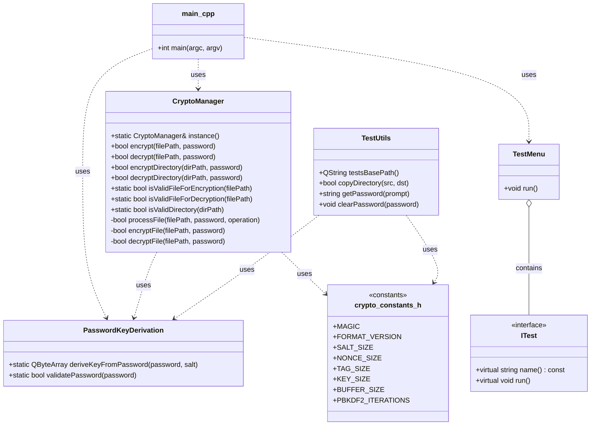

# Лабораторная работа по предмету: "Разработка средств защиты информации"

## 1. Постановка задачи

Необходимо разработать консольное приложение, которое позволяет:

- шифровать отдельные файлы;
- дешифровать отдельные файлы;
- рекурсивно шифровать директории;
- рекурсивно дешифровать директории.

Для защиты данных используется пароль, из которого формируется ключ, а содержимое файла шифруется алгоритмом AES-256-GCM.

---

## 2. Принцип работы

Программа получает на вход:

- путь к файлу или директории;
- пароль длиной от 8 до 256 символов.

Дальше выполняется следующая последовательность действий:

1. Проверяется корректность пути и прав доступа.
2. Для файла определяется, нужно ли его шифровать или дешифровать.
3. Для директории выполняется рекурсивный обход всех вложенных файлов.
4. Из пароля и случайной соли формируется ключ PBKDF2-HMAC-SHA256.
5. Файл шифруется по схеме AES-256-GCM.
6. В конец файла записывается тег аутентификации.
7. При дешифровании проверяется сигнатура и корректность тега.

### Формат зашифрованного файла

```text
MAGIC(7 байт) | VERSION(1 байт) | SALT(16 байт) | NONCE(12 байт) | DATA | TAG(16 байт)
```

Где:

- `MAGIC` — сигнатура `ENCFILE`;
- `VERSION` — версия формата файла;
- `SALT` — соль для генерации ключа;
- `NONCE` — случайное значение для AES-GCM;
- `DATA` — зашифрованные байты;
- `TAG` — тег проверки целостности.

---

## 3. Структура проекта

```text
.
├── CMakeLists.txt
├── crypto_constants.h
├── crypto_manager.h
├── crypto_manager.cpp
├── password_key_derivation.h
├── password_key_derivation.cpp
├── itest.h
├── test_menu.h
├── test_menu.cpp
├── test_utils.h
├── test_utils.cpp
├── main.cpp
└── README.md
```

---

## 4. Что делает каждый модуль

### `main.cpp`

Точка входа приложения. Запускает цикл меню, получает пользовательский ввод и вызывает операции шифрования/дешифрования.

### `CryptoManager`

Центральный класс приложения. Реализует:

- шифрование файла;
- дешифрование файла;
- шифрование директории;
- дешифрование директории;
- проверку корректности входных данных;
- обработку заголовка зашифрованного файла.

### `PasswordKeyDerivation`

Отвечает за генерацию ключа из пароля и проверку его длины.

### `crypto_constants.h`

Содержит параметры криптографических операций:

- размер ключа;
- размер соли;
- размер nonce;
- размер тега;
- количество итераций PBKDF2.

### `ITest`, `TestMenu`, `TestUtils`

Используются для тестового режима и вспомогательных операций, связанных с проверкой корректности работы программы.

---

## 5. Сборка

Для сборки проекта необходимы:

- CMake;
- Qt Core;
- OpenSSL;
- компилятор с поддержкой C++17.

Пример сборки:

```bash
mkdir build
cd build
cmake ..
cmake --build .
```

---

## 6. Запуск

После сборки запускается исполняемый файл приложения.

Пример запуска:

```bash
./Encoder
```

или на Windows:

```cmd
Encoder.exe
```

При старте пользователь видит меню:

```text
Выберите действие:
1. Зашифровать файл
2. Расшифровать файл
3. Зашифровать директорию
4. Расшифровать директорию
0. Выход
```

После выбора действия нужно ввести:

1. путь к объекту;
2. пароль.

---

## 7. UML-диаграмма

### Диаграмма классов



### Краткое пояснение

- `main.cpp` запускает меню и вызывает основные операции.
- `CryptoManager` управляет шифрованием и дешифрованием файлов и директорий.
- `PasswordKeyDerivation` формирует ключ из пароля.
- `crypto_constants.h` хранит параметры криптографии.
- `TestMenu` и вспомогательные классы используются в режиме проверки.

---

## 8. Особенности реализации

- используется `QSaveFile` для атомарной записи;
- ключ очищается из памяти после использования;
- при ошибке дешифрования файл не перезаписывается;
- директория обрабатывается рекурсивно через `QDirIterator`.

