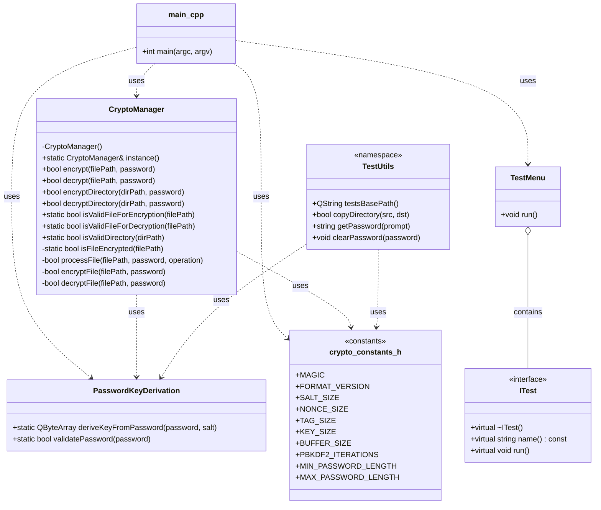
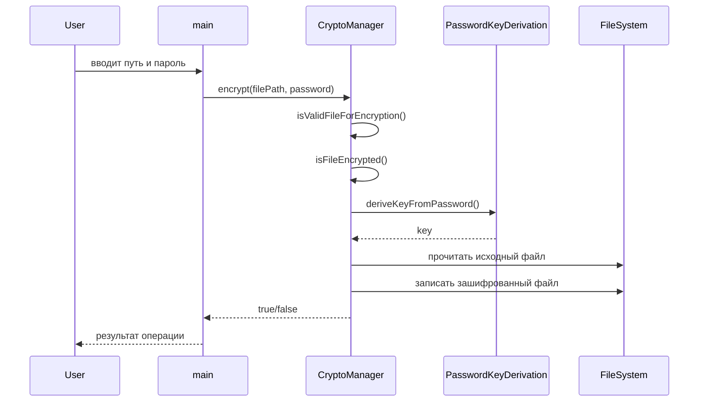

# UML диаграммы проекта

## 1. Диаграмма классов

## 2. Диаграмма последовательности (шифрование файла)

## 3. Краткое описание связей

- `main.cpp` запускает интерфейс приложения и вызывает операции шифрования/дешифрования.
- `CryptoManager` является центральным управляющим классом и реализует логику работы с файлами и директориями.
- `PasswordKeyDerivation` отвечает за формирование ключа из пароля.
- `TestMenu` и `ITest` предназначены для тестового режима.
- `crypto_constants.h` хранит параметры криптографических операций.
